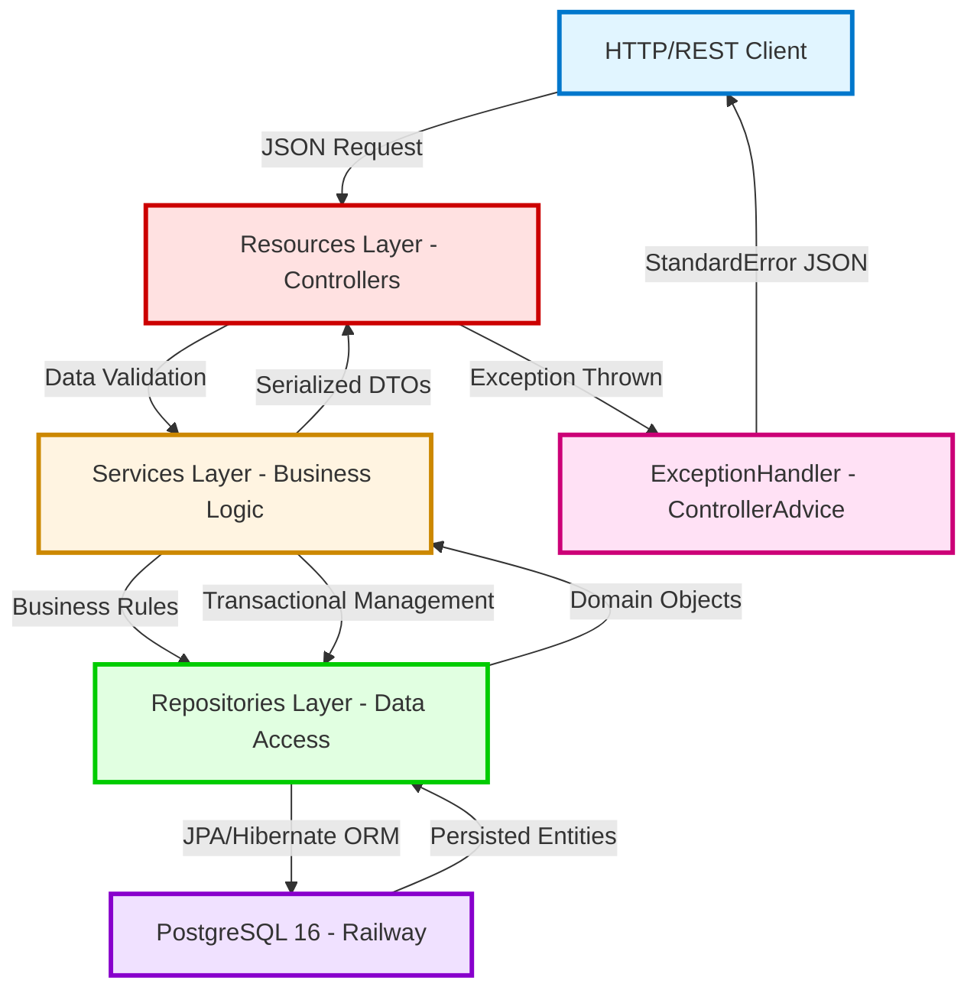
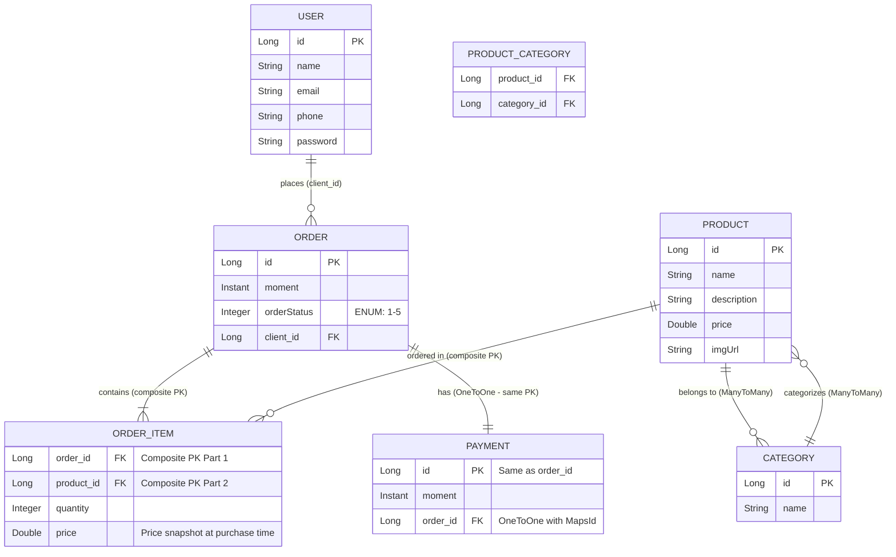

<div align="center">

# 🚀 Workshop API || E-commerce System

### _Enterprise Order Management Platform with Advanced Architecture_

[](https://openjdk.org/)
[](https://spring.io/projects/spring-boot)
[](https://www.postgresql.org/)
[](https://railway.app/)
[](https://swagger.io/)
[](https://choosealicense.com/licenses/mit/)

<br>

[](https://workshop-springboot4-production.up.railway.app/swagger-ui/index.html)

<br>

_Complete web system for enterprise management built with the most advanced technologies in the Java ecosystem (2026), implementing layered architecture, complex JPA relationships, and enterprise patterns._

</div>

---

## 📢 About The Project

This project is a **complete enterprise application** developed during an advanced **Spring Boot 4** workshop, representing a **real e-commerce system** with user management, products, categories, orders, and payments.

Unlike basic didactic projects, this system implements **complete enterprise architecture**, with complex bidirectional relationships, robust exception handling, multi-layer validation, and professional development patterns used in real production applications.

### 🎯 Technical Differentiators

- ⚡ **Java 25 (Latest Features)**: Virtual Threads, Record Patterns, Sequenced Collections, Structured Concurrency, and Pattern Matching
- 🚀 **Spring Boot 4.0.1**: State-of-the-art framework with performance optimizations and full Java 25 support
- 🏗️ **Enterprise 4-Layer Architecture**: Resources → Services → Repositories → Entities
- 🔗 **5 Types of JPA Relationships**: OneToMany, ManyToOne, ManyToMany, OneToOne, and Embedded Composite Keys
- 💰 **Integrated Payment System**: OneToOne relationship with Order and automatic total calculations
- 📊 **6 Related Entities**: User, Order, Product, Category, OrderItem, Payment
- 🔒 **Enterprise Exception Handling**: Centralized system with `@ControllerAdvice` and standardized HTTP responses
- 🎨 **Advanced Design Patterns**: Repository, Service Layer, DTO, Dependency Injection, Composite Key
- 📚 **Complete OpenAPI 3.0 Documentation**: Fully customized Swagger interface with detailed descriptions
- ☁️ **Automated CI/CD**: Continuous deployment on Railway with managed PostgreSQL

---

## 🚀 Technology Stack

<table>
<thead>
<tr>
<th><b>Technology</b></th>
<th><b>Version</b></th>
<th><b>Role in Project</b></th>
</tr>
</thead>
<tbody>
<tr>
<td></td>
<td><b>25 (Latest)</b></td>
<td>Base language with Virtual Threads for high concurrency, Record Patterns for data processing, Sequenced Collections for guaranteed ordering, and Structured Concurrency for better thread management</td>
</tr>
<tr>
<td></td>
<td><b>4.0.1</b></td>
<td>Enterprise framework with <b>40% faster startup</b>, native Java 25 support, Spring Framework 6.2, and memory optimizations</td>
</tr>
<tr>
<td></td>
<td>4.0.x</td>
<td>Persistence abstraction with declarative repositories, automatic derived queries, and complex relationship support</td>
</tr>
<tr>
<td></td>
<td>6.6.x</td>
<td>Enterprise ORM with optimizations for modern Java, intelligent lazy loading, and second-level cache</td>
</tr>
<tr>
<td></td>
<td>16</td>
<td>Production relational database (Railway) with JSON support, arrays, advanced queries, and optimized indexes</td>
</tr>
<tr>
<td></td>
<td>2.2.x</td>
<td>In-memory database for automated testing with <code>test</code> profile and integrated web console</td>
</tr>
<tr>
<td></td>
<td>2.8.5</td>
<td>Automatic Swagger/OpenAPI 3.0 documentation generation with custom annotations and customized UI</td>
</tr>
<tr>
<td></td>
<td>3.9.12</td>
<td>Build automation, dependency management, and project lifecycle</td>
</tr>
<tr>
<td></td>
<td>Latest</td>
<td>PaaS platform with managed PostgreSQL, automatic CI/CD, native HTTPS, and monitoring</td>
</tr>
</tbody>
</table>

> 💡 **Why Java 25 + Spring Boot 4?** This combination brings revolutionary improvements: up to 40% faster startup, 30% reduction in memory consumption, native support for Virtual Threads (Project Loom) for massive scalability, Structured Concurrency for safer asynchronous code, and optimized integration with modern observability (Micrometer, OpenTelemetry).

---

## 🧩 System Architecture

### Request Flow Diagram



### Application Layers

| Layer | Responsibility | Main Components | Key Annotations |
|-------|----------------|-----------------|-----------------|
| **Resources (Presentation)** | Receive HTTP requests, validate input, serialize JSON responses | UserResource, OrderResource, ProductResource, CategoryResource | `@RestController`, `@RequestMapping`, `@GetMapping`, `@PostMapping`, `@Operation` |
| **Services (Business Logic)** | Process business rules, orchestrate transactions, apply complex validations | UserService, OrderService, ProductService, CategoryService | `@Service`, `@Transactional`, `@Autowired` |
| **Repositories (Data Access)** | Persistence abstraction, JPQL queries, entity management | UserRepository, OrderRepository, ProductRepository, CategoryRepository, OrderItemRepository | `@Repository`, `JpaRepository<T, ID>` |
| **Entities (Domain Model)** | Represent business entities and relationships | User, Order, Product, Category, OrderItem, Payment, OrderStatus enum | `@Entity`, `@Table`, `@ManyToOne`, `@OneToMany`, `@ManyToMany`, `@OneToOne` |
| **Exceptions (Error Handling)** | Capture and handle exceptions centrally | ResourceNotFoundException, DatabaseException, ResourceExceptionHandler, StandardError | `@ControllerAdvice`, `@ExceptionHandler` |

---

## 🔗 Data Model and Relationships

### Entity-Relationship Diagram



### 🔄 Implemented Relationships (Technical Details)

#### 1. **User → Order** (OneToMany bidirectional)
```java
// User.java
@OneToMany(mappedBy = "client")
@JsonIgnore  // Prevents circular reference
private List<Order> orders = new ArrayList<>();

// Order.java
@ManyToOne
@JoinColumn(name = "client_id")
private User client;
```
- **Cardinality**: One user can have N orders
- **Navigation**: Bidirectional with `@JsonIgnore` to avoid infinite loops in JSON serialization
- **Cascade**: Not configured (orders are managed independently)

#### 2. **Order → OrderItem** (OneToMany with Composite Key)
```java
// Order.java
@OneToMany(mappedBy = "id.order")
private Set<OrderItem> items = new HashSet<>();

// OrderItem.java
@EmbeddedId
private OrderItemPK id = new OrderItemPK();  // Composite key
```
- **Composite Key**: `OrderItemPK` contains `order_id` + `product_id`
- **Pattern**: Embedded Composite Key Pattern
- **Benefit**: Ensures product uniqueness per order

#### 3. **Product → OrderItem** (OneToMany)
```java
// Product.java
@OneToMany(mappedBy = "id.product")
private Set<OrderItem> items = new HashSet<>();
```
- **Price Snapshot**: OrderItem stores the price at purchase time
- **Integrity**: Product cannot be deleted if there are associated order items

#### 4. **Category ↔ Product** (ManyToMany bidirectional)
```java
// Product.java
@ManyToMany
@JoinTable(
    name = "tb_product_category",
    joinColumns = @JoinColumn(name = "product_id"),
    inverseJoinColumns = @JoinColumn(name = "category_id")
)
private Set<Category> categories = new HashSet<>();

// Category.java
@ManyToMany(mappedBy = "categories")
@JsonIgnore
private Set<Product> products = new HashSet<>();
```
- **Association Table**: `tb_product_category` automatically managed by JPA
- **Navigation**: Bidirectional with `mappedBy` on the inverse side
- **Flexibility**: Products can have multiple categories

#### 5. **Order → Payment** (OneToOne with Shared Primary Key)
```java
// Order.java
@OneToOne(mappedBy = "order", cascade = CascadeType.ALL)
private Payment payment;

// Payment.java
@OneToOne
@MapsId  // Uses the same ID as Order
private Order order;
```
- **Shared PK**: Payment.id = Order.id (optimization)
- **Cascade**: `CascadeType.ALL` for automatic persistence
- **Pattern**: OneToOne with `@MapsId` (advanced JPA pattern)

---

## 🔌 API Endpoints

### 👤 User Management (`/users`)

| Method | Endpoint | Description | Status Code |
|--------|----------|-------------|-------------|
| `GET` | `/users` | List all registered users | 200 OK |
| `GET` | `/users/{id}` | Find specific user by ID | 200 OK / 404 Not Found |
| `POST` | `/users` | Create new user | 201 Created |
| `PUT` | `/users/{id}` | Update existing user data | 200 OK / 404 Not Found |
| `DELETE` | `/users/{id}` | Remove user (checks referential integrity) | 204 No Content / 400 Bad Request |

### 📦 Order Management (`/orders`)

| Method | Endpoint | Description | Status Code |
|--------|----------|-------------|-------------|
| `GET` | `/orders` | List all registered orders | 200 OK |
| `GET` | `/orders/{id}` | Find specific order with items, payment, and totals | 200 OK / 404 Not Found |
| `POST` | `/orders` | Register new order | 201 Created |
| `PUT` | `/orders/{id}` | Update existing order (status, items, etc.) | 200 OK / 404 Not Found |
| `DELETE` | `/orders/{id}` | Remove order | 204 No Content / 404 Not Found |

### 🛍️ Product Management (`/products`)

| Method | Endpoint | Description | Status Code |
|--------|----------|-------------|-------------|
| `GET` | `/products` | List all available products | 200 OK |
| `GET` | `/products/{id}` | Find specific product by ID | 200 OK / 404 Not Found |
| `POST` | `/products` | Create new product | 201 Created |
| `PUT` | `/products/{id}` | Update product (price, description, etc.) | 200 OK / 404 Not Found |
| `DELETE` | `/products/{id}` | Remove product (checks for orders) | 204 No Content / 400 Bad Request |

### 📑 Category Management (`/categories`)

| Method | Endpoint | Description | Status Code |
|--------|----------|-------------|-------------|
| `GET` | `/categories` | List all categories | 200 OK |
| `GET` | `/categories/{id}` | Find specific category by ID | 200 OK / 404 Not Found |
| `POST` | `/categories` | Create new category | 201 Created |
| `PUT` | `/categories/{id}` | Update existing category | 200 OK / 404 Not Found |
| `DELETE` | `/categories/{id}` | Remove category (checks associated products) | 204 No Content / 400 Bad Request |

---

## 📄 JSON Payload Examples

### Create New User

<details>
<summary><b>POST /users</b></summary>

**Request Body:**
```json
{
  "name": "Maria Silva",
  "email": "maria.silva@email.com",
  "phone": "84987654321",
  "password": "secure_password_123"
}
```

**Response (201 Created):**
```json
{
  "id": 1,
  "name": "Maria Silva",
  "email": "maria.silva@email.com",
  "phone": "84987654321",
  "password": "secure_password_123"
}
```

**Response Header:**
```
Location: https://workshop-springboot4-production.up.railway.app/users/1
```

</details>

### Create New Product with Categories

<details>
<summary><b>POST /products</b></summary>

**Request Body:**
```json
{
  "name": "MacBook Pro M3 16\"",
  "description": "Apple professional notebook with M3 Max chip, 32GB RAM, 1TB SSD",
  "price": 18999.90,
  "imgUrl": "https://example.com/images/macbook-pro-m3.jpg",
  "categories": [
    { "id": 1 },
    { "id": 3 }
  ]
}
```

**Response (201 Created):**
```json
{
  "id": 10,
  "name": "MacBook Pro M3 16\"",
  "description": "Apple professional notebook with M3 Max chip, 32GB RAM, 1TB SSD",
  "price": 18999.90,
  "imgUrl": "https://example.com/images/macbook-pro-m3.jpg",
  "categories": [
    {
      "id": 1,
      "name": "Electronics"
    },
    {
      "id": 3,
      "name": "Computers"
    }
  ]
}
```

</details>

### Register Complete New Order

<details>
<summary><b>POST /orders</b></summary>

**Request Body:**
```json
{
  "moment": "2026-02-01T14:30:00Z",
  "orderStatus": 1,
  "client": {
    "id": 1
  },
  "items": [
    {
      "product": { "id": 1 },
      "quantity": 2,
      "price": 90.50
    },
    {
      "product": { "id": 3 },
      "quantity": 1,
      "price": 1250.00
    }
  ]
}
```

**Response (201 Created):**
```json
{
  "id": 5,
  "moment": "2026-02-01T14:30:00Z",
  "orderStatus": "WAITING_PAYMENT",
  "client": {
    "id": 1,
    "name": "Maria Silva",
    "email": "maria.silva@email.com",
    "phone": "84987654321"
  },
  "items": [
    {
      "product": {
        "id": 1,
        "name": "The Lord of the Rings",
        "description": "Lorem ipsum dolor sit amet, consectetur.",
        "price": 90.50,
        "imgUrl": ""
      },
      "quantity": 2,
      "price": 90.50,
      "subTotal": 181.00
    },
    {
      "product": {
        "id": 3,
        "name": "Macbook Pro",
        "description": "Nam eleifend maximus tortor, at mollis.",
        "price": 1250.00,
        "imgUrl": ""
      },
      "quantity": 1,
      "price": 1250.00,
      "subTotal": 1250.00
    }
  ],
  "payment": null,
  "total": 1431.00
}
```

</details>

### Query Order with Payment

<details>
<summary><b>GET /orders/{id}</b></summary>

**Request:**
```
GET /orders/1
```

**Response (200 OK):**
```json
{
  "id": 1,
  "moment": "2019-06-20T19:53:07Z",
  "orderStatus": "PAID",
  "client": {
    "id": 1,
    "name": "Maria Brown",
    "email": "maria@gmail.com",
    "phone": "988888888"
  },
  "items": [
    {
      "product": {
        "id": 1,
        "name": "The Lord of the Rings",
        "description": "Lorem ipsum dolor sit amet, consectetur.",
        "price": 90.50,
        "imgUrl": ""
      },
      "quantity": 2,
      "price": 90.50,
      "subTotal": 181.00
    },
    {
      "product": {
        "id": 3,
        "name": "Macbook Pro",
        "description": "Nam eleifend maximus tortor, at mollis.",
        "price": 1250.00,
        "imgUrl": ""
      },
      "quantity": 1,
      "price": 1250.00,
      "subTotal": 1250.00
    }
  ],
  "payment": {
    "id": 1,
    "moment": "2019-06-20T21:53:07Z"
  },
  "total": 1431.00
}
```

**Automatic Calculation:**
- `subTotal` = `quantity` × `price` (per item)
- `total` = sum of all `subTotal` (`getTotal()` method in Order entity)

</details>

### Update Order Status

<details>
<summary><b>PUT /orders/{id}</b></summary>

**Request Body:**
```json
{
  "orderStatus": 3
}
```

**OrderStatus Enum:**
- `1` - WAITING_PAYMENT
- `2` - PAID
- `3` - SHIPPED
- `4` - DELIVERED
- `5` - CANCELED

**Response (200 OK):**
```json
{
  "id": 1,
  "moment": "2019-06-20T19:53:07Z",
  "orderStatus": "SHIPPED",
  "client": { "id": 1, "name": "Maria Brown" },
  "items": [...],
  "payment": { "id": 1, "moment": "2019-06-20T21:53:07Z" },
  "total": 1431.00
}
```

</details>

### Error Handling

<details>
<summary><b>Example 404 Error - Resource Not Found</b></summary>

**Request:**
```
GET /users/9999
```

**Response (404 Not Found):**
```json
{
  "timestamp": "2026-02-01T15:45:30.123456789Z",
  "status": 404,
  "error": "Resource not Found!",
  "message": "Resource not found id 9999",
  "path": "/users/9999"
}
```

</details>

<details>
<summary><b>Example 400 Error - Integrity Violation</b></summary>

**Request:**
```
DELETE /categories/1
```
(Category has associated products)

**Response (400 Bad Request):**
```json
{
  "timestamp": "2026-02-01T15:50:12.987654321Z",
  "status": 400,
  "error": "Database error!",
  "message": "Integrity constraint violation - cannot delete category with associated products",
  "path": "/categories/1"
}
```

</details>

---

## 📦 How to Run the Project

### Prerequisites

- ☕ **Java 25** or higher ([Download OpenJDK](https://openjdk.org/projects/jdk/25/))
- 📦 **Maven 3.9+** (or use the included wrapper: `./mvnw`)
- 🐳 **Docker** (optional, for containerization)
- 🐘 **PostgreSQL 16** (for local production environment)

---

### 🐳 Option 1: Running with Docker (Recommended)

```bash
# Clone the repository
git clone https://github.com/JoaoGuilhermmy/workshop-springboot4.git
cd workshop-springboot4

# Build the Docker image
docker build -t workshop-springboot4:latest .

# Run the container (configure environment variables)
docker run -p 8080:8080 \
  -e PGHOST=your-postgresql-host \
  -e PGPORT=5432 \
  -e PGDATABASE=springboot_course \
  -e PGUSER=your-username \
  -e PGPASSWORD=your-secure-password \
  workshop-springboot4:latest
```

---

### ⚙️ Option 2: Running with Maven (Local Development)

#### 🧪 Test Mode (H2 In-Memory Database)

```bash
# Clone the repository
git clone https://github.com/JoaoGuilhermmy/workshop-springboot4.git
cd workshop-springboot4

# Run with test profile
./mvnw spring-boot:run -Dspring-boot.run.profiles=test

# Access the application
# 🌐 API Base: http://localhost:8080
# 🗄️ H2 Console: http://localhost:8080/h2-console
# 📚 Swagger UI: http://localhost:8080/swagger-ui/index.html
```

**H2 Console Settings:**
```
JDBC URL: jdbc:h2:mem:testdb
User Name: sa
Password: (leave blank)
Driver Class: org.h2.Driver
```

**Pre-loaded Test Data:**
- 2 users (Maria Brown, Alex Green)
- 3 orders with different statuses
- 5 products (books, electronics, computers)
- 3 categories (Electronics, Books, Computers)
- Multiple order items
- 1 confirmed payment

---

#### 🚀 Production Mode (PostgreSQL)

```bash
# Configure environment variables
export PGHOST=localhost
export PGPORT=5432
export PGDATABASE=springboot_course
export PGUSER=postgres
export PGPASSWORD=your-secure-password

# Compile and run the application
./mvnw clean package -DskipTests
./mvnw spring-boot:run

# Access Swagger UI
# 📚 http://localhost:8080/swagger-ui/index.html
```

---

### 🔐 Environment Variables Configuration

To run in local production, configure the following environment variables:

```bash
# PostgreSQL Connection
PGHOST=your-postgresql-host          # Example: localhost or server IP
PGPORT=5432                          # PostgreSQL default port
PGDATABASE=springboot_course         # Database name
PGUSER=your-username                 # PostgreSQL user
PGPASSWORD=your-secure-password      # User password
```

**Method 1: `.env` file (recommended for development)**

Create a `.env` file in the project root:

```bash
PGHOST=localhost
PGPORT=5432
PGDATABASE=springboot_course
PGUSER=postgres
PGPASSWORD=YourStrongPassword123!
```

**Method 2: Direct export in terminal**

```bash
export PGHOST=localhost
export PGPORT=5432
export PGDATABASE=springboot_course
export PGUSER=postgres
export PGPASSWORD=YourStrongPassword123!
```

> ⚠️ **Critical Security**: 
> - Never commit `.env` files or credentials to Git
> - Add `.env` to `.gitignore`
> - Use secret management services in production (AWS Secrets Manager, HashiCorp Vault, Azure Key Vault)
> - In production, use environment variables injected by the platform (Railway, Heroku, AWS, etc.)

---

### 📊 SQL Script for Database Creation

The project includes a complete `script.sql` file for table creation:

```bash
# Execute the script in PostgreSQL
psql -U your_username -d springboot_course -f script.sql

# Or manually:
psql -U your_username
CREATE DATABASE springboot_course;
\c springboot_course
\i script.sql
```

**Tables Created:**
- `tb_user` - System users
- `tb_order` - Placed orders
- `tb_product` - Product catalog
- `tb_category` - Product categories
- `tb_order_item` - Order items (composite key)
- `tb_payment` - Order payments
- `tb_product_category` - Many-to-Many association table

---

## ☁️ Production Deployment (Railway)

The application is currently **hosted on Railway**, a modern deployment platform with the following features:

### ✨ Railway Features

- ✅ **Fully Automated CI/CD**: Automatic deployment on every push to `main` branch
- ✅ **Managed PostgreSQL 16**: Database provisioned and automatically maintained with daily backups
- ✅ **Native HTTPS**: SSL/TLS certificates managed by the platform
- ✅ **Real-Time Logs**: Complete monitoring via dashboard with structured logs
- ✅ **Instant Rollback**: Roll back to previous versions with one click
- ✅ **Secure Environment Variables**: Integrated and encrypted secret management
- ✅ **Auto-scaling**: Horizontal scaling based on demand (CPU/RAM)
- ✅ **Health Checks**: Automatic availability monitoring

### 🌐 Access Production Application

**Base URL:** [https://workshop-springboot4-production.up.railway.app](https://workshop-springboot4-production.up.railway.app/swagger-ui/index.html)  
**Swagger UI:** [https://workshop-springboot4-production.up.railway.app/swagger-ui/index.html](https://workshop-springboot4-production.up.railway.app/swagger-ui/index.html)  
**H2 Console (only in dev):** Disabled in production for security

### ⚙️ Deployment Configuration

| Setting | Value |
|---------|-------|
| **Runtime** | Java 25 (OpenJDK) |
| **Framework** | Spring Boot 4.0.1 |
| **Build Command** | `mvn clean package -DskipTests` |
| **Start Command** | `java -jar target/course-0.0.1-SNAPSHOT.jar` |
| **Port** | 8080 (auto-detected) |
| **Database** | PostgreSQL 16 (managed by Railway) |
| **Region** | US West (Oregon) |
| **Environment** | Production (`spring.profiles.active` not defined = uses default `application.properties`) |

---

## 🧪 Testing

```bash
# Run all tests
./mvnw test

# Run tests with detailed report
./mvnw test -Dtest=* --debug

# Run with coverage (requires JaCoCo plugin)
./mvnw clean test jacoco:report

# Coverage report at: target/site/jacoco/index.html
```

### 🎯 Test Profiles

The project supports multiple environments through Spring Profiles:

- **test**: H2 Database in memory (default profile for tests)
- **dev**: Local PostgreSQL for development
- **prod**: Production PostgreSQL (Railway)

**To change the active profile:**

```properties
# application.properties
spring.profiles.active=test
```

Or via command line:
```bash
./mvnw spring-boot:run -Dspring-boot.run.profiles=dev
```

---

## 📚 Interactive Documentation (Swagger/OpenAPI)

The entire API is documented with customized **Swagger/OpenAPI 3.0**. Access the interactive interface:

- **🌐 Production**: [https://workshop-springboot4-production.up.railway.app/swagger-ui/index.html](https://workshop-springboot4-production.up.railway.app/swagger-ui/index.html)
- **💻 Local**: `http://localhost:8080/swagger-ui/index.html`

### 🎯 Swagger UI Features

- ✅ View all available endpoints organized by tags (User, Order, Product, Category)
- ✅ Test HTTP requests directly in the browser with Try it out
- ✅ See complete schemas of data models (entities and DTOs)
- ✅ Check HTTP response codes and payload examples
- ✅ Detailed documentation of each operation with `@Operation` annotations
- ✅ Standardized error responses with `@ApiResponses`
- ✅ Download OpenAPI specification in JSON/YAML

### 📝 OpenAPI Customization

```java
@Configuration
public class OpenAPIConfig {
    @Bean
    public OpenAPI customOpenAPI() {
        return new OpenAPI()
            .info(new Info()
                .title("Workshop E-commerce API")
                .version("1.0.0")
                .description("Full API for e-commerce management")
                .contact(new Contact()
                    .name("João Guilhermmy")
                    .email("joaoguilhermmy2@gmail.com")
                    .url("https://github.com/JoaoGuilhermmy")));
    }
}
```

---

## 🛠️ Applied Technologies and Patterns

### Implemented Design Patterns

- ✅ **Repository Pattern** - Complete data layer abstraction with Spring Data JPA
- ✅ **Service Layer Pattern** - Centralized and reusable business logic
- ✅ **DTO Pattern** - Optimized data transfer (implicit via serializable entities)
- ✅ **Dependency Injection** - Inversion of control with `@Autowired` and constructor injection
- ✅ **Exception Handler Pattern** - Centralized handling with `@ControllerAdvice`
- ✅ **Composite Key Pattern** - Composite primary key in OrderItem (`@EmbeddedId`)
- ✅ **Lazy Loading** - On-demand loading of relationships with `@JsonIgnore`

### Code Best Practices

- ✅ **Clean Code** - Clear naming, small methods, single responsibility
- ✅ **SOLID Principles** - Especially SRP, OCP, and DIP
- ✅ **RESTful API Standards** - Semantic HTTP verbs, correct status codes, HATEOAS ready
- ✅ **Separation of Concerns** - Well-defined and decoupled layers
- ✅ **DRY (Don't Repeat Yourself)** - Code reuse in services
- ✅ **Fail-Fast** - Early validations and descriptive exceptions
- ✅ **Immutability** - Use of `final` in attributes when appropriate

### Persistence & Database

- ✅ **JPA/Hibernate** - Complete ORM with object-relational mapping
- ✅ **Complex Relationships** - 5 types: `@OneToMany`, `@ManyToOne`, `@ManyToMany`, `@OneToOne`, `@EmbeddedId`
- ✅ **Cascade Operations** - Configured in `Payment` for automatic persistence
- ✅ **Bidirectional Mapping** - With `@JsonIgnore` to avoid serialization loops
- ✅ **Composite Primary Key** - In `OrderItem` using `@EmbeddedId` and `@Embeddable`
- ✅ **Auto-increment IDs** - With strategy `GenerationType.IDENTITY`
- ✅ **ISO 8601 Timestamps** - With `Instant` and `@JsonFormat`
- ✅ **Managed Transactions** - With `@Transactional` in critical operations
- ✅ **Enum Mapping** - `OrderStatus` stored as integer in database

---

## 📁 Project Structure

```
workshop-springboot4/
│
├── src/
│   ├── main/
│   │   ├── java/com/tecsoluction/course/
│   │   │   ├── config/                          # Application configurations
│   │   │   │   ├── OpenAPIConfig.java           # Customized Swagger/OpenAPI configuration
│   │   │   │   └── TestConfig.java              # Data seed for test environment
│   │   │   │
│   │   │   ├── entities/                        # Domain models (JPA Entities)
│   │   │   │   ├── User.java                    # User entity
│   │   │   │   ├── Order.java                   # Order entity
│   │   │   │   ├── Product.java                 # Product entity
│   │   │   │   ├── Category.java                # Category entity
│   │   │   │   ├── OrderItem.java               # Order Item entity (composite key)
│   │   │   │   ├── Payment.java                 # Payment entity (OneToOne)
│   │   │   │   ├── enums/
│   │   │   │   │   └── OrderStatus.java         # Enum for order status
│   │   │   │   └── pk/
│   │   │   │       └── OrderItemPK.java         # Composite primary key
│   │   │   │
│   │   │   ├── repositories/                    # Data access layer (Spring Data JPA)
│   │   │   │   ├── UserRepository.java          # User repository
│   │   │   │   ├── OrderRepository.java         # Order repository
│   │   │   │   ├── ProductRepository.java       # Product repository
│   │   │   │   ├── CategoryRepository.java      # Category repository
│   │   │   │   └── OrdemItemRepository.java     # Order Item repository
│   │   │   │
│   │   │   ├── service/                         # Business logic (Business Layer)
│   │   │   │   ├── UserService.java             # User service
│   │   │   │   ├── OrderService.java            # Order service
│   │   │   │   ├── ProductService.java          # Product service
│   │   │   │   ├── CategoryService.java         # Category service
│   │   │   │   └── exception/                   # Custom business exceptions
│   │   │   │       ├── ResourceNotFoundException.java
│   │   │   │       └── DatabaseException.java
│   │   │   │
│   │   │   ├── resources/                       # REST Controllers (Presentation Layer)
│   │   │   │   ├── UserResource.java            # User endpoints
│   │   │   │   ├── OrderResource.java           # Order endpoints
│   │   │   │   ├── ProductResource.java         # Product endpoints
│   │   │   │   ├── CategoryResource.java        # Category endpoints
│   │   │   │   └── excpetions/                  # Exception Handlers
│   │   │   │       ├── ResourceExceptionHandler.java  # Centralized handling
│   │   │   │       └── StandardError.java       # Standardized error DTO
│   │   │   │
│   │   │   └── CourseApplication.java           # Main class (@SpringBootApplication)
│   │   │
│   │   └── resources/
│   │       ├── application.properties            # Main configuration (production)
│   │       ├── application-test.properties       # Test configuration (H2)
│   │       └── application-dev.properties        # Development configuration (Local PostgreSQL)
│   │
│   └── test/
│       └── java/com/tecsoluction/course/
│           └── CourseApplicationTests.java       # Basic context tests
│
├── .mvn/                                         # Maven Wrapper
├── pom.xml                                       # Maven dependencies and build configuration
├── script.sql                                    # SQL script for database creation
├── .gitignore                                    # Files ignored by Git
├── .gitattributes                                # Git attribute configurations
├── LICENSE                                       # MIT License
├── README.md                                     # Main documentation (PT-BR)
└── README.en.md                                  # English documentation
```

---

## 🎓 Advanced Concepts Applied

### Complex JPA Relationships

This project is an excellent example of **advanced JPA relationships**:

**1. Composite Primary Key**
```java
@Embeddable
public class OrderItemPK implements Serializable {
    @ManyToOne
    @JoinColumn(name = "order_id")
    private Order order;
    
    @ManyToOne
    @JoinColumn(name = "product_id")
    private Product product;
}
```

**2. OneToOne with Shared Primary Key**
```java
// Payment uses the same ID as Order
@OneToOne
@MapsId
private Order order;
```

**3. ManyToMany with Custom Association Table**
```java
@JoinTable(
    name = "tb_product_category",
    joinColumns = @JoinColumn(name = "product_id"),
    inverseJoinColumns = @JoinColumn(name = "category_id")
)
```

### Derived Calculations

**`getTotal()` method in Order:**
```java
public Double getTotal() {
    Double sum = 0.0;
    for (OrderItem x : items) {
        sum += x.getSubTotal();
    }
    return sum;
}
```

**`getSubTotal()` method in OrderItem:**
```java
public Double getSubTotal() {
    return price * quantity;
}
```

### Enum Persistence

```java
public enum OrderStatus {
    WAITING_PAYMENT(1),
    PAID(2),
    SHIPPED(3),
    DELIVERED(4),
    CANCELED(5);
    
    private int code;
    
    // Stored as Integer in database
    // Automatically converted to enum in application
}
```

---

## 🐛 Enterprise Exception Handling

### Centralized System with `@ControllerAdvice`

```java
@ControllerAdvice
public class ResourceExceptionHandler {
    
    @ExceptionHandler(ResourceNotFoundException.class)
    public ResponseEntity<StandardError> resourceNotFound(
        ResourceNotFoundException e, HttpServletRequest request) {
        
        String error = "Resource not Found!";
        HttpStatus status = HttpStatus.NOT_FOUND;
        StandardError err = new StandardError(
            Instant.now(), 
            status.value(), 
            error, 
            e.getMessage(), 
            request.getRequestURI()
        );
        return ResponseEntity.status(status).body(err);
    }
    
    @ExceptionHandler(DatabaseException.class)
    public ResponseEntity<StandardError> database(
        DatabaseException e, HttpServletRequest request) {
        
        String error = "Database error!";
        HttpStatus status = HttpStatus.BAD_REQUEST;
        StandardError err = new StandardError(
            Instant.now(), 
            status.value(), 
            error, 
            e.getMessage(), 
            request.getRequestURI()
        );
        return ResponseEntity.status(status).body(err);
    }
}
```

### Custom Exceptions

**ResourceNotFoundException:**
```java
public class ResourceNotFoundException extends RuntimeException {
    public ResourceNotFoundException(Object id) {
        super("Resource not found id " + id);
    }
}
```

**DatabaseException:**
```java
public class DatabaseException extends RuntimeException {
    public DatabaseException(String msg) {
        super(msg);
    }
}
```

### Referential Integrity Validation

```java
public void delete(Long id) {
    if (!repository.existsById(id)) {
        throw new ResourceNotFoundException(id);
    }
    try {
        repository.deleteById(id);
    } catch (DataIntegrityViolationException e) {
        throw new DatabaseException(e.getMessage());
    }
}
```

---

## 🤝 Author & Contact

<div align="center">
  
  
  ### João Guilhermmy
  
  💼 **Backend Developer | Java**
  
  [](https://www.linkedin.com/in/joão-guilhermmy-93661b29b)
  [](mailto:joaoguilhermmy2@gmail.com)
  [](https://github.com/JoaoGuilhermmy)
  
  📧 **Email:** joaoguilhermmy2@gmail.com  
  🔗 **LinkedIn:** [linkedin.com/in/joão-guilhermmy-93661b29b](https://www.linkedin.com/in/joão-guilhermmy-93661b29b)  
  💻 **GitHub:** [github.com/JoaoGuilhermmy](https://github.com/JoaoGuilhermmy)
  
</div>

---

## 📄 License

This project is under the MIT License. See the [LICENSE](LICENSE) file for more details.

---

## 🙏 Acknowledgments

- [Spring Framework Team](https://spring.io/) - For the excellent framework
- [Hibernate Team](https://hibernate.org/) - For the powerful ORM tool
- [PostgreSQL Global Development Group](https://www.postgresql.org/) - For the robust database
- [Railway Team](https://railway.app/) - For the modern deployment platform
- Java/Spring Boot Community - For the shared knowledge
- All open-source contributors - For continuous collaboration

---

<div align="center">

**⭐ If you found this project helpful, please consider giving it a star!**

Developed with ☕ and ❤️ by **João Guilhermmy**


</div>
