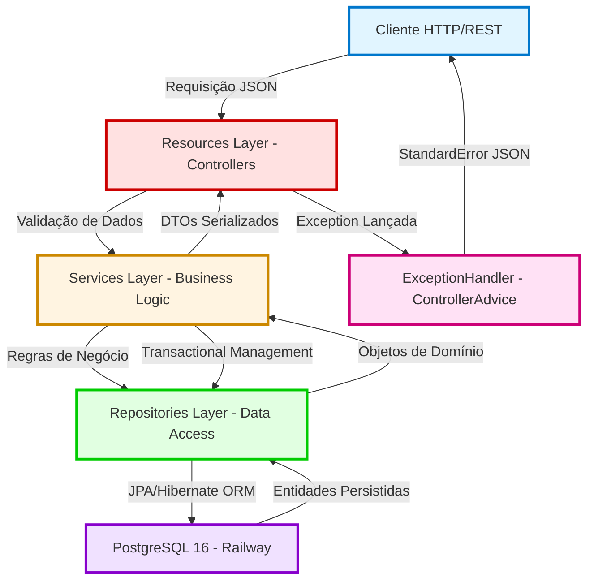
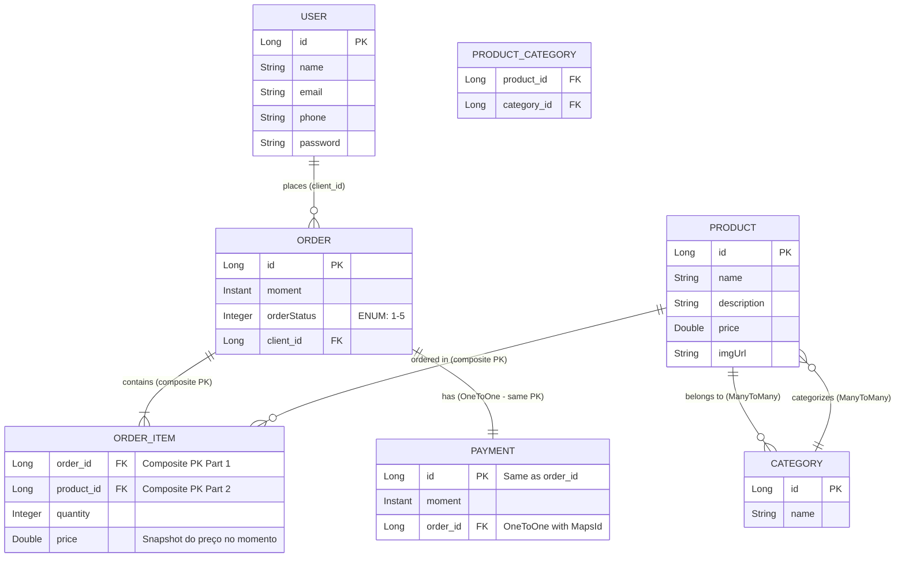

<div align="center">

# 🚀 Workshop API || E-commerce system

### _Plataforma Empresarial de Gestão de Pedidos com Arquitetura Avançada_

[](https://openjdk.org/)
[](https://spring.io/projects/spring-boot)
[](https://www.postgresql.org/)
[](https://railway.app/)
[](https://swagger.io/)
[](https://choosealicense.com/licenses/mit/)

<br>

[](https://workshop-springboot4-production.up.railway.app/swagger-ui/index.html)

<br>

_Sistema web completo de gerenciamento empresarial desenvolvido com as tecnologias mais avançadas do ecossistema Java (2026), implementando arquitetura em camadas, relacionamentos complexos JPA e padrões enterprise._

</div>

---

## 📢 Sobre o Projeto

Este projeto é uma **aplicação empresarial completa** desenvolvida durante um workshop avançado de **Spring Boot 4**, representando um **sistema real de e-commerce** com gestão de usuários, produtos, categorias, pedidos e pagamentos.

Diferente de projetos didáticos básicos, este sistema implementa **arquitetura enterprise completa**, com relacionamentos bidirecionais complexos, tratamento robusto de exceções, validações em múltiplas camadas, e padrões de desenvolvimento profissionais que são utilizados em aplicações reais de produção.

### 🎯 Diferenciais Técnicos

- ⚡ **Java 25 (Latest Features)**: Virtual Threads, Record Patterns, Sequenced Collections, Structured Concurrency e Pattern Matching
- 🚀 **Spring Boot 4.0.1**: Framework de última geração com otimizações de performance e suporte total ao Java 25
- 🏗️ **Arquitetura Enterprise em 4 Camadas**: Resources → Services → Repositories → Entities
- 🔗 **5 Tipos de Relacionamentos JPA**: OneToMany, ManyToOne, ManyToMany, OneToOne, e Embedded Composite Keys
- 💰 **Sistema de Pagamentos Integrado**: Relacionamento OneToOne com Order e cálculos automáticos de totais
- 📊 **6 Entidades Relacionadas**: User, Order, Product, Category, OrderItem, Payment
- 🔒 **Exception Handling Enterprise**: Sistema centralizado com `@ControllerAdvice` e respostas HTTP padronizadas
- 🎨 **Design Patterns Avançados**: Repository, Service Layer, DTO, Dependency Injection, Composite Key
- 📚 **Documentação OpenAPI 3.0 Completa**: Interface Swagger totalmente personalizada com descrições detalhadas
- ☁️ **CI/CD Automatizado**: Deploy contínuo na Railway com PostgreSQL gerenciado

---

## 🚀 Stack Tecnológica

<table>
<thead>
<tr>
<th><b>Tecnologia</b></th>
<th><b>Versão</b></th>
<th><b>Função no Projeto</b></th>
</tr>
</thead>
<tbody>
<tr>
<td></td>
<td><b>25 (Latest)</b></td>
<td>Linguagem base com Virtual Threads para alta concorrência, Record Patterns para processamento de dados, Sequenced Collections para ordenação garantida, e Structured Concurrency para melhor gerenciamento de threads</td>
</tr>
<tr>
<td></td>
<td><b>4.0.1</b></td>
<td>Framework enterprise com <b>startup 40% mais rápido</b>, suporte nativo ao Java 25, Spring Framework 6.2, e otimizações de memória</td>
</tr>
<tr>
<td></td>
<td>4.0.x</td>
<td>Abstração de persistência com repositórios declarativos, queries derivadas automáticas, e suporte a relacionamentos complexos</td>
</tr>
<tr>
<td></td>
<td>6.6.x</td>
<td>ORM enterprise com otimizações para Java moderno, lazy loading inteligente, e cache de segundo nível</td>
</tr>
<tr>
<td></td>
<td>16</td>
<td>Banco de dados relacional em produção (Railway) com suporte a JSON, arrays, queries avançadas e índices otimizados</td>
</tr>
<tr>
<td></td>
<td>2.2.x</td>
<td>Banco em memória para testes automatizados com perfil <code>test</code> e console web integrado</td>
</tr>
<tr>
<td></td>
<td>2.8.5</td>
<td>Geração automática de documentação Swagger/OpenAPI 3.0 com anotações personalizadas e UI customizada</td>
</tr>
<tr>
<td></td>
<td>3.9.12</td>
<td>Build automation, gerenciamento de dependências e ciclo de vida do projeto</td>
</tr>
<tr>
<td></td>
<td>Latest</td>
<td>Plataforma PaaS com PostgreSQL gerenciado, CI/CD automático, HTTPS nativo e monitoramento</td>
</tr>
</tbody>
</table>

> 💡 **Por que Java 25 + Spring Boot 4?** Esta combinação traz melhorias revolucionárias: startup até 40% mais rápido, redução de 30% no consumo de memória, suporte nativo às Virtual Threads (Project Loom) para escalabilidade massiva, Structured Concurrency para código assíncrono mais seguro, e integração otimizada com observabilidade moderna (Micrometer, OpenTelemetry).

---

## 🧩 Arquitetura do Sistema

### Diagrama de Fluxo de Requisições



### Camadas da Aplicação

| Camada | Responsabilidade | Principais Componentes | Anotações Chave |
|--------|------------------|----------------------|-----------------|
| **Resources (Presentation)** | Receber requisições HTTP, validar entrada, serializar respostas JSON | UserResource, OrderResource, ProductResource, CategoryResource | `@RestController`, `@RequestMapping`, `@GetMapping`, `@PostMapping`, `@Operation` |
| **Services (Business Logic)** | Processar regras de negócio, orquestrar transações, aplicar validações complexas | UserService, OrderService, ProductService, CategoryService | `@Service`, `@Transactional`, `@Autowired` |
| **Repositories (Data Access)** | Abstração de persistência, queries JPQL, gerenciamento de entidades | UserRepository, OrderRepository, ProductRepository, CategoryRepository, OrderItemRepository | `@Repository`, `JpaRepository<T, ID>` |
| **Entities (Domain Model)** | Representar entidades de negócio e relacionamentos | User, Order, Product, Category, OrderItem, Payment, OrderStatus enum | `@Entity`, `@Table`, `@ManyToOne`, `@OneToMany`, `@ManyToMany`, `@OneToOne` |
| **Exceptions (Error Handling)** | Capturar e tratar exceções de forma centralizada | ResourceNotFoundException, DatabaseException, ResourceExceptionHandler, StandardError | `@ControllerAdvice`, `@ExceptionHandler` |

---

## 🔗 Modelo de Dados e Relacionamentos

### Diagrama Entidade-Relacionamento



### 🔄 Relacionamentos Implementados (Detalhamento Técnico)

#### 1. **User → Order** (OneToMany bidirectional)
```java
// User.java
@OneToMany(mappedBy = "client")
@JsonIgnore  // Evita referência circular
private List<Order> orders = new ArrayList<>();

// Order.java
@ManyToOne
@JoinColumn(name = "client_id")
private User client;
```
- **Cardinalidade**: Um usuário pode ter N pedidos
- **Navegação**: Bidirectional com `@JsonIgnore` para evitar loops infinitos na serialização JSON
- **Cascade**: Não configurado (pedidos são gerenciados independentemente)

#### 2. **Order → OrderItem** (OneToMany com Composite Key)
```java
// Order.java
@OneToMany(mappedBy = "id.order")
private Set<OrderItem> items = new HashSet<>();

// OrderItem.java
@EmbeddedId
private OrderItemPK id = new OrderItemPK();  // Chave composta
```
- **Chave Composta**: `OrderItemPK` contém `order_id` + `product_id`
- **Padrão**: Embedded Composite Key Pattern
- **Benefício**: Garante unicidade de produto por pedido

#### 3. **Product → OrderItem** (OneToMany)
```java
// Product.java
@OneToMany(mappedBy = "id.product")
private Set<OrderItem> items = new HashSet<>();
```
- **Snapshot de Preço**: OrderItem armazena o preço no momento da compra
- **Integridade**: Produto não pode ser deletado se houver itens de pedido associados

#### 4. **Category ↔ Product** (ManyToMany bidirectional)
```java
// Product.java
@ManyToMany
@JoinTable(
    name = "tb_product_category",
    joinColumns = @JoinColumn(name = "product_id"),
    inverseJoinColumns = @JoinColumn(name = "category_id")
)
private Set<Category> categories = new HashSet<>();

// Category.java
@ManyToMany(mappedBy = "categories")
@JsonIgnore
private Set<Product> products = new HashSet<>();
```
- **Tabela Associativa**: `tb_product_category` gerenciada automaticamente pelo JPA
- **Navegação**: Bidirectional com `mappedBy` no lado inverso
- **Flexibilidade**: Produtos podem ter múltiplas categorias

#### 5. **Order → Payment** (OneToOne com Shared Primary Key)
```java
// Order.java
@OneToOne(mappedBy = "order", cascade = CascadeType.ALL)
private Payment payment;

// Payment.java
@OneToOne
@MapsId  // Usa o mesmo ID do Order
private Order order;
```
- **Shared PK**: Payment.id = Order.id (otimização)
- **Cascade**: `CascadeType.ALL` para persistência automática
- **Padrão**: OneToOne com `@MapsId` (advanced JPA pattern)

---

## 🔌 Endpoints da API

### 👤 Gerenciamento de Usuários (`/users`)

| Método | Endpoint | Descrição | Status Code |
|--------|----------|-----------|-------------|
| `GET` | `/users` | Lista todos os usuários cadastrados | 200 OK |
| `GET` | `/users/{id}` | Busca usuário específico por ID | 200 OK / 404 Not Found |
| `POST` | `/users` | Cria novo usuário | 201 Created |
| `PUT` | `/users/{id}` | Atualiza dados de usuário existente | 200 OK / 404 Not Found |
| `DELETE` | `/users/{id}` | Remove usuário (verifica integridade referencial) | 204 No Content / 400 Bad Request |

### 📦 Gerenciamento de Pedidos (`/orders`)

| Método | Endpoint | Descrição | Status Code |
|--------|----------|-----------|-------------|
| `GET` | `/orders` | Lista todos os pedidos registrados | 200 OK |
| `GET` | `/orders/{id}` | Busca pedido específico com itens, pagamento e totais | 200 OK / 404 Not Found |
| `POST` | `/orders` | Registra novo pedido | 201 Created |
| `PUT` | `/orders/{id}` | Atualiza pedido existente (status, itens, etc.) | 200 OK / 404 Not Found |
| `DELETE` | `/orders/{id}` | Remove pedido | 204 No Content / 404 Not Found |

### 🛍️ Gerenciamento de Produtos (`/products`)

| Método | Endpoint | Descrição | Status Code |
|--------|----------|-----------|-------------|
| `GET` | `/products` | Lista todos os produtos disponíveis | 200 OK |
| `GET` | `/products/{id}` | Busca produto específico por ID | 200 OK / 404 Not Found |
| `POST` | `/products` | Cria novo produto | 201 Created |
| `PUT` | `/products/{id}` | Atualiza produto (preço, descrição, etc.) | 200 OK / 404 Not Found |
| `DELETE` | `/products/{id}` | Remove produto (verifica se não há pedidos) | 204 No Content / 400 Bad Request |

### 📑 Gerenciamento de Categorias (`/categories`)

| Método | Endpoint | Descrição | Status Code |
|--------|----------|-----------|-------------|
| `GET` | `/categories` | Lista todas as categorias | 200 OK |
| `GET` | `/categories/{id}` | Busca categoria específica por ID | 200 OK / 404 Not Found |
| `POST` | `/categories` | Cria nova categoria | 201 Created |
| `PUT` | `/categories/{id}` | Atualiza categoria existente | 200 OK / 404 Not Found |
| `DELETE` | `/categories/{id}` | Remove categoria (verifica produtos associados) | 204 No Content / 400 Bad Request |

---

## 📄 Exemplos de Payloads JSON

### Criar Novo Usuário

<details>
<summary><b>POST /users</b></summary>

**Request Body:**
```json
{
  "name": "Maria Silva",
  "email": "maria.silva@email.com",
  "phone": "84987654321",
  "password": "senha_segura_123"
}
```

**Response (201 Created):**
```json
{
  "id": 1,
  "name": "Maria Silva",
  "email": "maria.silva@email.com",
  "phone": "84987654321",
  "password": "senha_segura_123"
}
```

**Response Header:**
```
Location: https://workshop-springboot4-production.up.railway.app/users/1
```

</details>

### Criar Novo Produto com Categorias

<details>
<summary><b>POST /products</b></summary>

**Request Body:**
```json
{
  "name": "MacBook Pro M3 16\"",
  "description": "Notebook profissional Apple com chip M3 Max, 32GB RAM, 1TB SSD",
  "price": 18999.90,
  "imgUrl": "https://example.com/images/macbook-pro-m3.jpg",
  "categories": [
    { "id": 1 },
    { "id": 3 }
  ]
}
```

**Response (201 Created):**
```json
{
  "id": 10,
  "name": "MacBook Pro M3 16\"",
  "description": "Notebook profissional Apple com chip M3 Max, 32GB RAM, 1TB SSD",
  "price": 18999.90,
  "imgUrl": "https://example.com/images/macbook-pro-m3.jpg",
  "categories": [
    {
      "id": 1,
      "name": "Electronics"
    },
    {
      "id": 3,
      "name": "Computers"
    }
  ]
}
```

</details>

### Registrar Novo Pedido Completo

<details>
<summary><b>POST /orders</b></summary>

**Request Body:**
```json
{
  "moment": "2026-02-01T14:30:00Z",
  "orderStatus": 1,
  "client": {
    "id": 1
  },
  "items": [
    {
      "product": { "id": 1 },
      "quantity": 2,
      "price": 90.50
    },
    {
      "product": { "id": 3 },
      "quantity": 1,
      "price": 1250.00
    }
  ]
}
```

**Response (201 Created):**
```json
{
  "id": 5,
  "moment": "2026-02-01T14:30:00Z",
  "orderStatus": "WAITING_PAYMENT",
  "client": {
    "id": 1,
    "name": "Maria Silva",
    "email": "maria.silva@email.com",
    "phone": "84987654321"
  },
  "items": [
    {
      "product": {
        "id": 1,
        "name": "The Lord of the Rings",
        "description": "Lorem ipsum dolor sit amet, consectetur.",
        "price": 90.50,
        "imgUrl": ""
      },
      "quantity": 2,
      "price": 90.50,
      "subTotal": 181.00
    },
    {
      "product": {
        "id": 3,
        "name": "Macbook Pro",
        "description": "Nam eleifend maximus tortor, at mollis.",
        "price": 1250.00,
        "imgUrl": ""
      },
      "quantity": 1,
      "price": 1250.00,
      "subTotal": 1250.00
    }
  ],
  "payment": null,
  "total": 1431.00
}
```

</details>

### Consultar Pedido com Pagamento

<details>
<summary><b>GET /orders/{id}</b></summary>

**Request:**
```
GET /orders/1
```

**Response (200 OK):**
```json
{
  "id": 1,
  "moment": "2019-06-20T19:53:07Z",
  "orderStatus": "PAID",
  "client": {
    "id": 1,
    "name": "Maria Brown",
    "email": "maria@gmail.com",
    "phone": "988888888"
  },
  "items": [
    {
      "product": {
        "id": 1,
        "name": "The Lord of the Rings",
        "description": "Lorem ipsum dolor sit amet, consectetur.",
        "price": 90.50,
        "imgUrl": ""
      },
      "quantity": 2,
      "price": 90.50,
      "subTotal": 181.00
    },
    {
      "product": {
        "id": 3,
        "name": "Macbook Pro",
        "description": "Nam eleifend maximus tortor, at mollis.",
        "price": 1250.00,
        "imgUrl": ""
      },
      "quantity": 1,
      "price": 1250.00,
      "subTotal": 1250.00
    }
  ],
  "payment": {
    "id": 1,
    "moment": "2019-06-20T21:53:07Z"
  },
  "total": 1431.00
}
```

**Cálculo Automático:**
- `subTotal` = `quantity` × `price` (por item)
- `total` = soma de todos os `subTotal` (método `getTotal()` na entidade Order)

</details>

### Atualizar Status do Pedido

<details>
<summary><b>PUT /orders/{id}</b></summary>

**Request Body:**
```json
{
  "orderStatus": 3
}
```

**OrderStatus Enum:**
- `1` - WAITING_PAYMENT
- `2` - PAID
- `3` - SHIPPED
- `4` - DELIVERED
- `5` - CANCELED

**Response (200 OK):**
```json
{
  "id": 1,
  "moment": "2019-06-20T19:53:07Z",
  "orderStatus": "SHIPPED",
  "client": { "id": 1, "name": "Maria Brown" },
  "items": [...],
  "payment": { "id": 1, "moment": "2019-06-20T21:53:07Z" },
  "total": 1431.00
}
```

</details>

### Tratamento de Erros

<details>
<summary><b>Exemplo de Erro 404 - Recurso Não Encontrado</b></summary>

**Request:**
```
GET /users/9999
```

**Response (404 Not Found):**
```json
{
  "timestamp": "2026-02-01T15:45:30.123456789Z",
  "status": 404,
  "error": "Resource not Found!",
  "message": "Resource not found id 9999",
  "path": "/users/9999"
}
```

</details>

<details>
<summary><b>Exemplo de Erro 400 - Violação de Integridade</b></summary>

**Request:**
```
DELETE /categories/1
```
(Categoria possui produtos associados)

**Response (400 Bad Request):**
```json
{
  "timestamp": "2026-02-01T15:50:12.987654321Z",
  "status": 400,
  "error": "Database error!",
  "message": "Integrity constraint violation - cannot delete category with associated products",
  "path": "/categories/1"
}
```

</details>

---

## 📦 Como Rodar o Projeto

### Pré-requisitos

- ☕ **Java 25** ou superior ([Download OpenJDK](https://openjdk.org/projects/jdk/25/))
- 📦 **Maven 3.9+** (ou use o wrapper incluído: `./mvnw`)
- 🐳 **Docker** (opcional, para containerização)
- 🐘 **PostgreSQL 16** (para ambiente de produção local)

---

### 🐳 Opção 1: Rodando com Docker (Recomendado)

```bash
# Clone o repositório
git clone https://github.com/JoaoGuilhermmy/workshop-springboot4.git
cd workshop-springboot4

# Construa a imagem Docker
docker build -t workshop-springboot4:latest .

# Execute o container (configure as variáveis de ambiente)
docker run -p 8080:8080 \
  -e PGHOST=seu-postgresql-host \
  -e PGPORT=5432 \
  -e PGDATABASE=springboot_course \
  -e PGUSER=seu-usuario \
  -e PGPASSWORD=sua-senha-segura \
  workshop-springboot4:latest
```

---

### ⚙️ Opção 2: Rodando com Maven (Desenvolvimento Local)

#### 🧪 Modo Teste (H2 Database em Memória)

```bash
# Clone o repositório
git clone https://github.com/JoaoGuilhermmy/workshop-springboot4.git
cd workshop-springboot4

# Execute com perfil de teste
./mvnw spring-boot:run -Dspring-boot.run.profiles=test

# Acesse a aplicação
# 🌐 API Base: http://localhost:8080
# 🗄️ H2 Console: http://localhost:8080/h2-console
# 📚 Swagger UI: http://localhost:8080/swagger-ui/index.html
```

**Configurações do H2 Console:**
```
JDBC URL: jdbc:h2:mem:testdb
User Name: sa
Password: (deixe em branco)
Driver Class: org.h2.Driver
```

**Dados de Teste Pré-carregados:**
- 2 usuários (Maria Brown, Alex Green)
- 3 pedidos com diferentes status
- 5 produtos (livros, eletrônicos, computadores)
- 3 categorias (Electronics, Books, Computers)
- Múltiplos itens de pedido
- 1 pagamento confirmado

---

#### 🚀 Modo Produção (PostgreSQL)

```bash
# Configure as variáveis de ambiente
export PGHOST=localhost
export PGPORT=5432
export PGDATABASE=springboot_course
export PGUSER=postgres
export PGPASSWORD=sua-senha-segura

# Compile e execute a aplicação
./mvnw clean package -DskipTests
./mvnw spring-boot:run

# Acesse o Swagger UI
# 📚 http://localhost:8080/swagger-ui/index.html
```

---

### 🔐 Configuração de Variáveis de Ambiente

Para rodar em produção local, configure as seguintes variáveis de ambiente:

```bash
# PostgreSQL Connection
PGHOST=seu-postgresql-host          # Ex: localhost ou IP do servidor
PGPORT=5432                          # Porta padrão do PostgreSQL
PGDATABASE=springboot_course         # Nome do banco de dados
PGUSER=seu-usuario                   # Usuário do PostgreSQL
PGPASSWORD=sua-senha-segura          # Senha do usuário
```

**Método 1: Arquivo `.env` (recomendado para desenvolvimento)**

Crie um arquivo `.env` na raiz do projeto:

```bash
PGHOST=localhost
PGPORT=5432
PGDATABASE=springboot_course
PGUSER=postgres
PGPASSWORD=SuaSenhaForte123!
```

**Método 2: Export direto no terminal**

```bash
export PGHOST=localhost
export PGPORT=5432
export PGDATABASE=springboot_course
export PGUSER=postgres
export PGPASSWORD=SuaSenhaForte123!
```

> ⚠️ **Segurança Crítica**: 
> - Nunca commite arquivos `.env` ou credenciais no Git
> - Adicione `.env` ao `.gitignore`
> - Use serviços de gerenciamento de secrets em produção (AWS Secrets Manager, HashiCorp Vault, Azure Key Vault)
> - Em produção, use variáveis de ambiente injetadas pela plataforma (Railway, Heroku, AWS, etc.)

---

### 📊 Script SQL para Criação do Banco

O projeto inclui um arquivo `script.sql` completo para criação das tabelas:

```bash
# Execute o script no PostgreSQL
psql -U seu_usuario -d springboot_course -f script.sql

# Ou manualmente:
psql -U seu_usuario
CREATE DATABASE springboot_course;
\c springboot_course
\i script.sql
```

**Tabelas Criadas:**
- `tb_user` - Usuários do sistema
- `tb_order` - Pedidos realizados
- `tb_product` - Catálogo de produtos
- `tb_category` - Categorias de produtos
- `tb_order_item` - Itens dos pedidos (composite key)
- `tb_payment` - Pagamentos dos pedidos
- `tb_product_category` - Tabela associativa Many-to-Many

---

## ☁️ Deploy em Produção (Railway)

A aplicação está atualmente **hospedada na Railway**, uma plataforma moderna de deploy com as seguintes características:

### ✨ Features da Railway

- ✅ **CI/CD Totalmente Automatizado**: Deploy automático a cada push na branch `main`
- ✅ **PostgreSQL 16 Gerenciado**: Banco de dados provisionado e mantido automaticamente com backups diários
- ✅ **HTTPS Nativo**: Certificados SSL/TLS gerenciados pela plataforma
- ✅ **Logs em Tempo Real**: Monitoramento completo via dashboard com logs estruturados
- ✅ **Rollback Instantâneo**: Voltar para versões anteriores com um clique
- ✅ **Variáveis de Ambiente Seguras**: Gerenciamento de secrets integrado e criptografado
- ✅ **Auto-scaling**: Escala horizontal conforme demanda (CPU/RAM)
- ✅ **Health Checks**: Monitoramento automático de disponibilidade

### 🌐 Acessar Aplicação em Produção

**URL Base:** [https://workshop-springboot4-production.up.railway.app](https://workshop-springboot4-production.up.railway.app/swagger-ui/index.html)  
**Swagger UI:** [https://workshop-springboot4-production.up.railway.app/swagger-ui/index.html](https://workshop-springboot4-production.up.railway.app/swagger-ui/index.html)  
**H2 Console (somente em dev):** Desabilitado em produção por segurança

### ⚙️ Configurações do Deploy

| Configuração | Valor |
|--------------|-------|
| **Runtime** | Java 25 (OpenJDK) |
| **Framework** | Spring Boot 4.0.1 |
| **Build Command** | `mvn clean package -DskipTests` |
| **Start Command** | `java -jar target/course-0.0.1-SNAPSHOT.jar` |
| **Port** | 8080 (detectado automaticamente) |
| **Database** | PostgreSQL 16 (gerenciado pela Railway) |
| **Region** | US West (Oregon) |
| **Environment** | Production (`spring.profiles.active` não definido = usa `application.properties` padrão) |

---

## 🧪 Testes

```bash
# Executar todos os testes
./mvnw test

# Executar testes com relatório detalhado
./mvnw test -Dtest=* --debug

# Executar com cobertura (requer plugin JaCoCo)
./mvnw clean test jacoco:report

# Relatório de cobertura em: target/site/jacoco/index.html
```

### 🎯 Profiles de Teste

O projeto suporta múltiplos ambientes através de Spring Profiles:

- **test**: H2 Database em memória (perfil padrão para testes)
- **dev**: PostgreSQL local para desenvolvimento
- **prod**: PostgreSQL em produção (Railway)

**Para alterar o profile ativo:**

```properties
# application.properties
spring.profiles.active=test
```

Ou via linha de comando:
```bash
./mvnw spring-boot:run -Dspring-boot.run.profiles=dev
```

---

## 📚 Documentação Interativa (Swagger/OpenAPI)

Toda a API está documentada com **Swagger/OpenAPI 3.0** personalizado. Acesse a interface interativa:

- **🌐 Produção**: [https://workshop-springboot4-production.up.railway.app/swagger-ui/index.html](https://workshop-springboot4-production.up.railway.app/swagger-ui/index.html)
- **💻 Local**: `http://localhost:8080/swagger-ui/index.html`

### 🎯 Recursos do Swagger UI

- ✅ Visualizar todos os endpoints disponíveis organizados por tags (User, Order, Product, Category)
- ✅ Testar requisições HTTP diretamente no navegador com Try it out
- ✅ Ver schemas completos dos modelos de dados (entidades e DTOs)
- ✅ Consultar códigos de resposta HTTP e exemplos de payloads
- ✅ Documentação detalhada de cada operação com `@Operation` annotations
- ✅ Respostas de erro padronizadas com `@ApiResponses`
- ✅ Download da especificação OpenAPI em JSON/YAML

### 📝 Customização OpenAPI

```java
@Configuration
public class OpenAPIConfig {
    @Bean
    public OpenAPI customOpenAPI() {
        return new OpenAPI()
            .info(new Info()
                .title("Workshop E-commerce API")
                .version("1.0.0")
                .description("Full API for e-commerce management")
                .contact(new Contact()
                    .name("João Guilhermmy")
                    .email("joaoguilhermmy2@gmail.com")
                    .url("https://github.com/JoaoGuilhermmy")));
    }
}
```

---

## 🛠️ Tecnologias e Padrões Aplicados

### Design Patterns Implementados

- ✅ **Repository Pattern** - Abstração completa da camada de dados com Spring Data JPA
- ✅ **Service Layer Pattern** - Lógica de negócio centralizada e reutilizável
- ✅ **DTO Pattern** - Transferência de dados otimizada (implícito via entidades serializáveis)
- ✅ **Dependency Injection** - Inversão de controle com `@Autowired` e injeção por construtor
- ✅ **Exception Handler Pattern** - Tratamento centralizado com `@ControllerAdvice`
- ✅ **Composite Key Pattern** - Chave primária composta em OrderItem (`@EmbeddedId`)
- ✅ **Lazy Loading** - Carregamento sob demanda de relacionamentos com `@JsonIgnore`

### Boas Práticas de Código

- ✅ **Clean Code** - Nomenclatura clara, métodos pequenos, responsabilidade única
- ✅ **SOLID Principles** - Especialmente SRP, OCP e DIP
- ✅ **RESTful API Standards** - Verbos HTTP semânticos, status codes corretos, HATEOAS preparado
- ✅ **Separation of Concerns** - Camadas bem definidas e desacopladas
- ✅ **DRY (Don't Repeat Yourself)** - Reutilização de código em services
- ✅ **Fail-Fast** - Validações precoces e exceções descritivas
- ✅ **Immutability** - Uso de `final` em atributos quando apropriado

### Persistência & Banco de Dados

- ✅ **JPA/Hibernate** - ORM completo com mapeamento objeto-relacional
- ✅ **Relacionamentos Complexos** - 5 tipos: `@OneToMany`, `@ManyToOne`, `@ManyToMany`, `@OneToOne`, `@EmbeddedId`
- ✅ **Cascade Operations** - Configurado em `Payment` para persistência automática
- ✅ **Bidirectional Mapping** - Com `@JsonIgnore` para evitar loops de serialização
- ✅ **Composite Primary Key** - Em `OrderItem` usando `@EmbeddedId` e `@Embeddable`
- ✅ **Auto-increment IDs** - Com estratégia `GenerationType.IDENTITY`
- ✅ **Timestamps ISO 8601** - Com `Instant` e `@JsonFormat`
- ✅ **Transações Gerenciadas** - Com `@Transactional` em operações críticas
- ✅ **Enum Mapping** - `OrderStatus` armazenado como inteiro no banco

---

## 📁 Estrutura do Projeto

```
workshop-springboot4/
│
├── src/
│   ├── main/
│   │   ├── java/com/tecsoluction/course/
│   │   │   ├── config/                          # Configurações da aplicação
│   │   │   │   ├── OpenAPIConfig.java           # Configuração Swagger/OpenAPI personalizada
│   │   │   │   └── TestConfig.java              # Seed de dados para ambiente de teste
│   │   │   │
│   │   │   ├── entities/                        # Modelos de domínio (JPA Entities)
│   │   │   │   ├── User.java                    # Entidade Usuário
│   │   │   │   ├── Order.java                   # Entidade Pedido
│   │   │   │   ├── Product.java                 # Entidade Produto
│   │   │   │   ├── Category.java                # Entidade Categoria
│   │   │   │   ├── OrderItem.java               # Entidade Item de Pedido (composite key)
│   │   │   │   ├── Payment.java                 # Entidade Pagamento (OneToOne)
│   │   │   │   ├── enums/
│   │   │   │   │   └── OrderStatus.java         # Enum para status do pedido
│   │   │   │   └── pk/
│   │   │   │       └── OrderItemPK.java         # Chave primária composta
│   │   │   │
│   │   │   ├── repositories/                    # Camada de acesso a dados (Spring Data JPA)
│   │   │   │   ├── UserRepository.java          # Repositório de Usuários
│   │   │   │   ├── OrderRepository.java         # Repositório de Pedidos
│   │   │   │   ├── ProductRepository.java       # Repositório de Produtos
│   │   │   │   ├── CategoryRepository.java      # Repositório de Categorias
│   │   │   │   └── OrdemItemRepository.java     # Repositório de Itens de Pedido
│   │   │   │
│   │   │   ├── service/                         # Lógica de negócio (Business Layer)
│   │   │   │   ├── UserService.java             # Serviço de Usuários
│   │   │   │   ├── OrderService.java            # Serviço de Pedidos
│   │   │   │   ├── ProductService.java          # Serviço de Produtos
│   │   │   │   ├── CategoryService.java         # Serviço de Categorias
│   │   │   │   └── exception/                   # Exceções customizadas de negócio
│   │   │   │       ├── ResourceNotFoundException.java
│   │   │   │       └── DatabaseException.java
│   │   │   │
│   │   │   ├── resources/                       # Controllers REST (Presentation Layer)
│   │   │   │   ├── UserResource.java            # Endpoints de Usuários
│   │   │   │   ├── OrderResource.java           # Endpoints de Pedidos
│   │   │   │   ├── ProductResource.java         # Endpoints de Produtos
│   │   │   │   ├── CategoryResource.java        # Endpoints de Categorias
│   │   │   │   └── excpetions/                  # Exception Handlers
│   │   │   │       ├── ResourceExceptionHandler.java  # Tratamento centralizado
│   │   │   │       └── StandardError.java       # DTO de erro padronizado
│   │   │   │
│   │   │   └── CourseApplication.java           # Classe principal (@SpringBootApplication)
│   │   │
│   │   └── resources/
│   │       ├── application.properties            # Configuração principal (produção)
│   │       ├── application-test.properties       # Configuração para testes (H2)
│   │       └── application-dev.properties        # Configuração para desenvolvimento (PostgreSQL local)
│   │
│   └── test/
│       └── java/com/tecsoluction/course/
│           └── CourseApplicationTests.java       # Testes básicos de contexto
│
├── .mvn/                                         # Maven Wrapper
├── pom.xml                                       # Dependências Maven e configuração do build
├── script.sql                                    # Script SQL para criação do banco de dados
├── .gitignore                                    # Arquivos ignorados pelo Git
├── .gitattributes                                # Configurações de atributos Git
├── LICENSE                                       # Licença MIT
├── README.md                                     # Documentação principal (PT-BR)
└── README.en.md                                  # Documentação em inglês
```

---

## 🎓 Conceitos Avançados Aplicados

### Relacionamentos JPA Complexos

Este projeto é um excelente exemplo de **relacionamentos avançados em JPA**:

**1. Composite Primary Key (Chave Primária Composta)**
```java
@Embeddable
public class OrderItemPK implements Serializable {
    @ManyToOne
    @JoinColumn(name = "order_id")
    private Order order;
    
    @ManyToOne
    @JoinColumn(name = "product_id")
    private Product product;
}
```

**2. OneToOne com Shared Primary Key**
```java
// Payment usa o mesmo ID do Order
@OneToOne
@MapsId
private Order order;
```

**3. ManyToMany com Tabela Associativa Customizada**
```java
@JoinTable(
    name = "tb_product_category",
    joinColumns = @JoinColumn(name = "product_id"),
    inverseJoinColumns = @JoinColumn(name = "category_id")
)
```

### Cálculos Derivados

**Método `getTotal()` em Order:**
```java
public Double getTotal() {
    Double sum = 0.0;
    for (OrderItem x : items) {
        sum += x.getSubTotal();
    }
    return sum;
}
```

**Método `getSubTotal()` em OrderItem:**
```java
public Double getSubTotal() {
    return price * quantity;
}
```

### Enum Persistence

```java
public enum OrderStatus {
    WAITING_PAYMENT(1),
    PAID(2),
    SHIPPED(3),
    DELIVERED(4),
    CANCELED(5);
    
    private int code;
    
    // Armazenado como Integer no banco
    // Convertido automaticamente em enum na aplicação
}
```

---

## 🐛 Tratamento de Exceções Enterprise

### Sistema Centralizado com `@ControllerAdvice`

```java
@ControllerAdvice
public class ResourceExceptionHandler {
    
    @ExceptionHandler(ResourceNotFoundException.class)
    public ResponseEntity<StandardError> resourceNotFound(
        ResourceNotFoundException e, HttpServletRequest request) {
        
        String error = "Resource not Found!";
        HttpStatus status = HttpStatus.NOT_FOUND;
        StandardError err = new StandardError(
            Instant.now(), 
            status.value(), 
            error, 
            e.getMessage(), 
            request.getRequestURI()
        );
        return ResponseEntity.status(status).body(err);
    }
    
    @ExceptionHandler(DatabaseException.class)
    public ResponseEntity<StandardError> database(
        DatabaseException e, HttpServletRequest request) {
        
        String error = "Database error!";
        HttpStatus status = HttpStatus.BAD_REQUEST;
        StandardError err = new StandardError(
            Instant.now(), 
            status.value(), 
            error, 
            e.getMessage(), 
            request.getRequestURI()
        );
        return ResponseEntity.status(status).body(err);
    }
}
```

### Exceções Customizadas

**ResourceNotFoundException:**
```java
public class ResourceNotFoundException extends RuntimeException {
    public ResourceNotFoundException(Object id) {
        super("Resource not found id " + id);
    }
}
```

**DatabaseException:**
```java
public class DatabaseException extends RuntimeException {
    public DatabaseException(String msg) {
        super(msg);
    }
}
```

### Validação de Integridade Referencial

```java
public void delete(Long id) {
    if (!repository.existsById(id)) {
        throw new ResourceNotFoundException(id);
    }
    try {
        repository.deleteById(id);
    } catch (DataIntegrityViolationException e) {
        throw new DatabaseException(e.getMessage());
    }
}
```

---

## 🤝 Autor & Contato

<div align="center">
  
  
  ### João Guilhermmy
  
  💼 **Backend Developer | Java & Spring Boot Specialist**
  
  [](https://www.linkedin.com/in/joão-guilhermmy-93661b29b)
  [](mailto:joaoguilhermmy2@gmail.com)
  [](https://github.com/JoaoGuilhermmy)
  
  📧 **Email:** joaoguilhermmy2@gmail.com  
  🔗 **LinkedIn:** [linkedin.com/in/joão-guilhermmy-93661b29b](https://www.linkedin.com/in/joão-guilhermmy-93661b29b)  
  💻 **GitHub:** [github.com/JoaoGuilhermmy](https://github.com/JoaoGuilhermmy)
  
</div>

---

## 📄 Licença

Este projeto está sob a licença MIT. Veja o arquivo [LICENSE](LICENSE) para mais detalhes.

---

## 🙏 Agradecimentos

- [Spring Framework Team](https://spring.io/) - Pelo excelente framework
- [Hibernate Team](https://hibernate.org/) - Pela poderosa ferramenta ORM
- [PostgreSQL Global Development Group](https://www.postgresql.org/) - Pelo banco de dados robusto
- [Railway Team](https://railway.app/) - Pela plataforma de deploy moderna
- Comunidade Java/Spring Boot - Pelo conhecimento compartilhado
- Todos os contribuidores open-source - Pela colaboração contínua

---

<div align="center">

**⭐ Se este projeto foi útil para você, considere dar uma estrela no repositório!**

Desenvolvido com ☕ e ❤️ por **João Guilhermmy**


</div>
